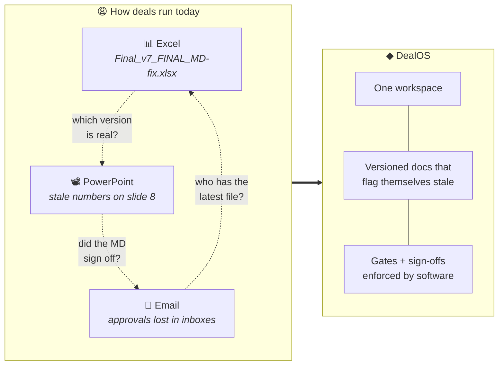
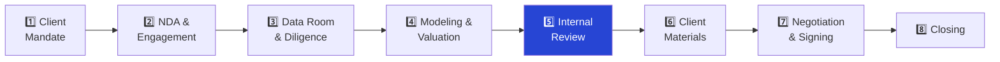
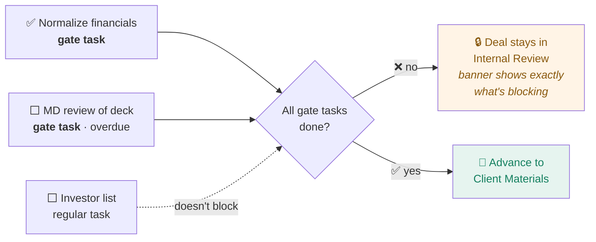
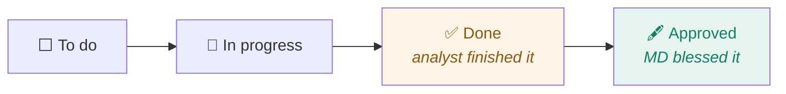
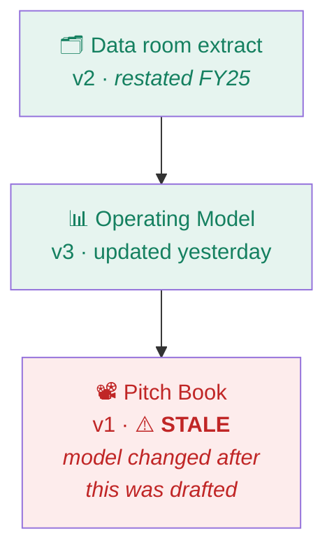
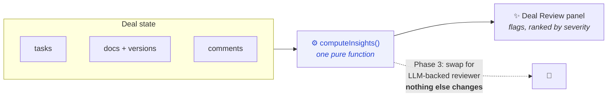
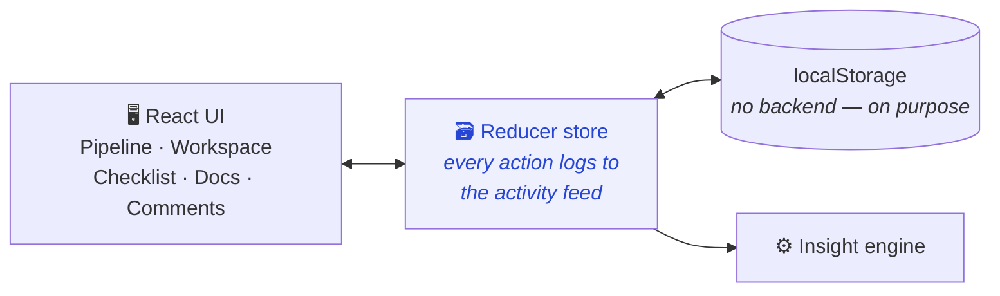
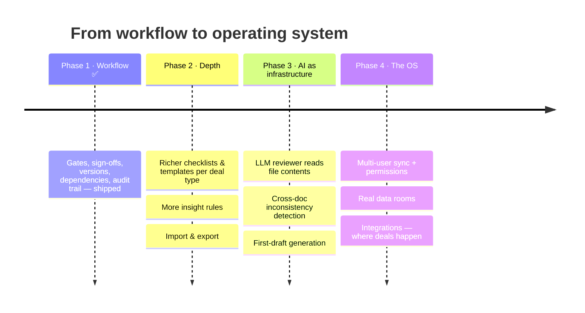

<div align="center">

# ◆ DealOS

### The open-source operating system for deal execution

**GitHub became where software gets built. Figma became where design happens.<br>DealOS is where deals get done.**


</div>

---

## 🔥 The problem, in one picture



AI startups automate single tasks — models, pitch books, diligence.
**Nobody owns the workflow those tasks live inside.** And everyone executes deals: banks, boutiques, Big 4, PE, corp dev, family offices.

---

## 🗺️ How a deal flows

Eight stages. Every deal is a card moving left → right on a kanban board.



---

## 🔒 Stage gates — deals advance only when the work says so



**Bonus rule — done ≠ approved.** Tasks can require senior sign-off, tracked *separately* from completion:



---

## 📄 Documents that know when they're stale

Documents declare **dependencies**. When an upstream doc gets a new version, everything downstream is flagged automatically — *before* the client sees inconsistent numbers.



Each doc also moves through a review lifecycle with full version history + change notes:

`draft` → `in review` → `approved`

---

## ✨ Deal Review — AI as infrastructure, not chatbot

A panel on every deal that continuously runs six checks:

| | Check | Catches |
|---|---|---|
| 🔴 | **Stale documents** | A dependency updated after this doc's last version |
| 🔴 | **Overdue tasks** | Deadlines slipping — weighted higher if they block the stage |
| 🟠 | **Open stage gates** | Exactly what stands between the deal and the next stage |
| 🟠 | **Missing sign-offs** | Work marked done that no senior approved |
| ⚪ | **Aging comments** | Unresolved feedback older than 3 days |
| ⚪ | **Stuck reviews** | Documents sitting in "in review" limbo |



The bet: AI should **quietly review the deal in the background** — not sit in a chat window. Today it's a deterministic rules engine; swapping in an LLM later replaces one function ([`computeInsights` in `src/types.ts`](src/types.ts)).

---

## 🚀 Quick start

```bash
npm install
npm run dev        # → http://localhost:5173
```

Ships with **5 realistic seeded deals** (sell-side renewables, buy-side consumer, hospital capital raise, logistics deal in final negotiation, fresh mandate). Dates are generated relative to today, so the demo always looks live. Data lives in localStorage — **Reset demo data** (sidebar, click twice) restores the seed.

---

## 🏗️ How it's built



| File | Role |
|---|---|
| [`src/types.ts`](src/types.ts) | Domain model **+ Deal Review rules engine** |
| [`src/seed.ts`](src/seed.ts) | 5 demo deals, relative dates |
| [`src/store.tsx`](src/store.tsx) | Reducer + persistence; mutations auto-log to activity feed |
| [`src/Pipeline.tsx`](src/Pipeline.tsx) | Kanban board across the 8 stages |
| [`src/Workspace.tsx`](src/Workspace.tsx) | Per-deal workspace (5 tabs) |
| [`src/NewDealModal.tsx`](src/NewDealModal.tsx) | Deal creation |
| [`src/App.tsx`](src/App.tsx) | Shell + navigation |

> **Why no backend?** Deliberately zero-infrastructure: clone, `npm install`, and you have the full product running in 30 seconds — no database, no docker-compose, no signup. The reducer is already shaped like an event log, so multi-user sync (server API / CRDTs) slots in without a rewrite when the project gets there.

---

## 🧭 Roadmap



**The thesis in one line:** capture the real workflow first — AI is only as valuable as the process it lives inside.

---

## 🤝 Contributing

Contributions are welcome — especially from people who've lived inside real deals.

- **Know deals, not code?** Open an issue describing a workflow pain point: review cycles, approval bottlenecks, version chaos, "we always do it this way" processes. Ground truth about how deal teams actually work is the most valuable contribution this project can get.
- **Know code?** Good first areas:
  - New insight rules in [`computeInsights`](src/types.ts) — it's one pure function, easy to extend and test
  - Deal-type-specific checklist templates (LBO vs. sell-side vs. capital raise)
  - Import/export (JSON, CSV)
  - Accessibility and keyboard navigation
- Keep PRs small and focused. `npm run build` must pass (it typechecks).

## 📄 License

[MIT](LICENSE) — use it, fork it, run your deals on it.

---

<div align="center">
<sub>Built by people who've lived through the version chaos. ◆</sub>
</div>
